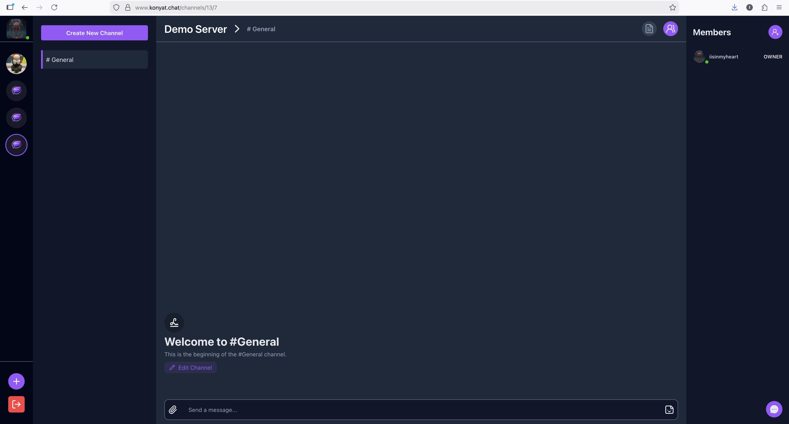
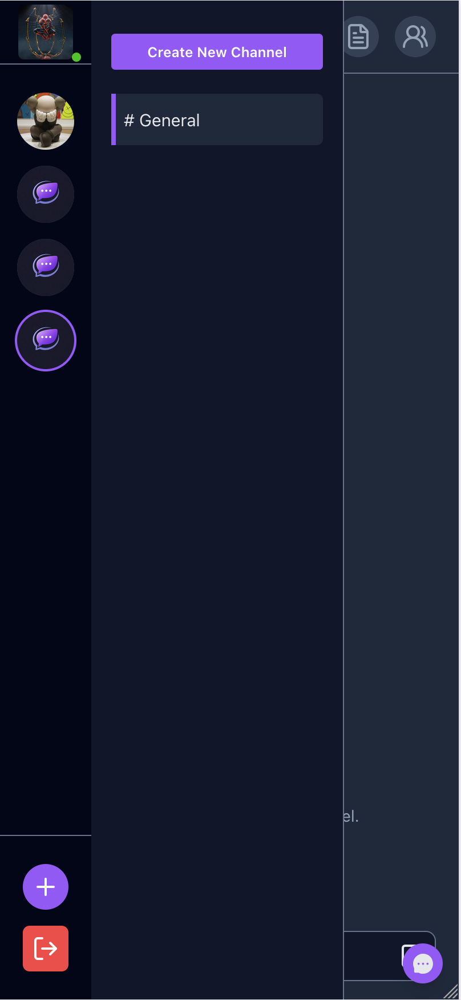

# Konyat


A real-time web application that enables users to communicate, collaborate, and manage channels efficiently.  
Built with a modern full-stack architecture using Next.js, Express, PostgreSQL, and WebSockets.

---

## 🚀 Demo

🌐 Live: https://www.konyat.chat

---

## 📸 Screenshots

### Desktop



### Mobile



---

## ✨ Features

- ⚡ Real-time messaging using WebSockets
- 🔐 User authentication and authorization
- 💬 Channel-based communication system
- 📱 Fully responsive design (mobile + desktop)
- 🔄 RESTful API for client-server communication
- 🗄 Persistent data storage with PostgreSQL
- 👥 Multi-user collaboration support

---

## 🛠 Tech Stack

### Frontend

- Next.js
- React
- Tailwind CSS

### Backend

- Node.js
- Express.js

### Database

- PostgreSQL

### Other Technologies

- WebSocket (real-time communication)
- Prisma (ORM)

---

## 🧠 Architecture

The application follows a **client-server architecture**:

- The frontend (Next.js) handles UI and user interactions
- The backend (Express) provides RESTful APIs
- WebSockets enable real-time communication (e.g., messaging)
- PostgreSQL is used for persistent data storage
- Clear separation between frontend and backend improves scalability and maintainability

---

## ⚙️ Installation & Setup

### 1. Clone the repository

```bash
git clone https://github.com/htetooyan-i/chat-app.git
cd chat-app
```

### 2. Install dependencies

#### Frontend

```bash
cd frontend
npm install
cd ..
```

#### Backend

```bash
cd backend
npm install
cd ..
```

### 3. Environment Variables

Create a `.env` file in the backend folder:

```env
# Authentication
ACCESS_TOKEN_EXPIRES=7d
REFRESH_TOKEN_EXPIRES=30d
JWT_SECRET=your_super_long_random_jwt_secret

# Backend URLs
BACKEND_URL=http://localhost:4000
FRONTEND_URL=http://localhost:3000

# Database
DATABASE_URL="postgresql://<db_user>:<db_password>@<db_host>/<db_name>?sslmode=require"

# Email
ETHEREAL_HOST=smtp.ethereal.email
ETHEREAL_PAS=your_ethereal_password
ETHEREAL_USER=your_ethereal_user_email
FROM_EMAIL="App Name <no-reply@example.com>"

# Cloudinary
CLOUDINARY_API_KEY=your_cloudinary_api_key
CLOUDINARY_API_SECRET=your_cloudinary_api_secret
CLOUDINARY_CLOUD_NAME=your_cloudinary_cloud_name

# Third-party services
RESEND_API_KEY=your_resend_api_key
TWILIO_ACCOUNT_SID=your_twilio_account_sid
TWILIO_AUTH_TOKEN=your_twilio_auth_token
TWILIO_PHONE_NUMBER=your_twilio_phone_number
TWILIO_VERIFY_SERVICE_SID=your_twilio_verify_service_sid
INVITE_CODE_LENGTH=8
```

Create a `.env` file in the frontend folder:

```env
NEXT_PUBLIC_SOCKET_URL=http://localhost:4000
NEXT_PUBLIC_API_URL=http://localhost:4000/api
NEXT_PUBLIC_BASE_URL=localhost:3000
NEXT_PUBLIC_CLOUDINARY_CLOUD_NAME=your_cloudinary_cloud_name
NEXT_PUBLIC_CLOUDINARY_API_KEY=your_cloudinary_api_key
NEXT_PUBLIC_GIPHY_API_KEY=your_giphy_api_key
```
